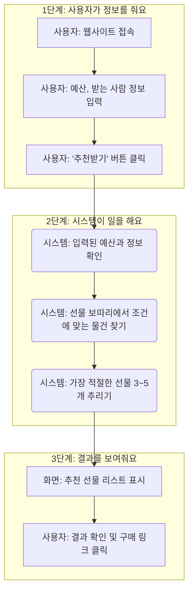

# 민순의 요청

```text
* 역할: 너는 시스템 설계자야.
* 상황: 비개발자 1인 창업가가 서비스 내 데이터의 흐름을 시각적으로 이해하고 싶어 해.
* 과업: 사용자가 웹 사이트에 접속해서 결과를 얻기까지의 과정을 '입력 -> 처리 -> 출력' 순서로 그려 줘.
* 제약: 전문 용어 대신 '사용자 클릭', '선물 찾기', '화면 표시' 같은 쉬운 말을 써 줘.
* 출력: 텍스트 기반 흐름도 (Flowchart)
* 입력: [서비스의 핵심 기능]
 (예시: 사용자가 예산을 입력하면 선물을 추천받는 과정)
```

# 제미나이의 응답

안녕하세요! 시스템 설계자입니다.

비개발자이신 대표님께서 서비스의 전체적인 흐름을 한눈에 파악하실 수 있도록, 어려운 IT 용어는 모두 배제하고 **'사용자의 행동'**과 **'시스템의 반응'** 위주로 흐름도를 그려드리겠습니다.

현재 구체적인 **[서비스의 핵심 기능]**을 입력해주지 않으셔서, 예시로 들어주신 **'예산 기반 선물 추천 서비스'**를 기준으로 먼저 흐름도를 작성했습니다.

이 양식을 보시고, **구상 중인 서비스의 내용**을 알려주시면 바로 다시 그려드리겠습니다.

---

### 🎁 [예시] 선물 추천 서비스 데이터 흐름도



---

### 텍스트 상세 설명

**1. 입력 (Input)**
*   **사용자:** 웹사이트에 들어옵니다.
*   **사용자:** "3만 원대", "20대 여성" 같은 조건을 입력합니다.
*   **사용자:** [추천받기] 버튼을 누릅니다. (이때 데이터가 시스템으로 넘어갑니다.)

**2. 처리 (Process)**
*   **시스템:** 사용자가 보낸 조건(3만 원, 20대 여성)을 받습니다.
*   **시스템:** 가지고 있는 수많은 선물 리스트 중에서 조건에 맞는 것을 뒤집니다.
*   **시스템:** 그중에서 가장 인기 있거나 적절한 선물 몇 가지를 골라냅니다.

**3. 출력 (Output)**
*   **화면:** 시스템이 골라낸 선물 사진과 가격을 예쁘게 보여줍니다.
*   **사용자:** 추천된 선물을 보고 마음에 드는 것을 선택합니다.

---

**💡 이제 대표님이 구상 중인 [서비스의 핵심 기능]을 알려주세요! 위와 같은 방식으로 알기 쉽게 그려드리겠습니다.**